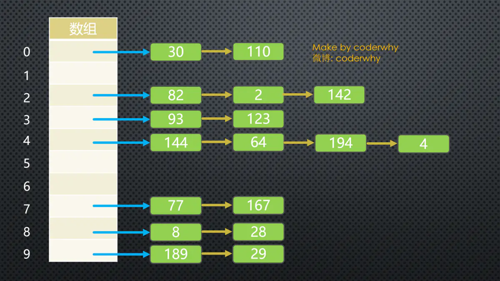
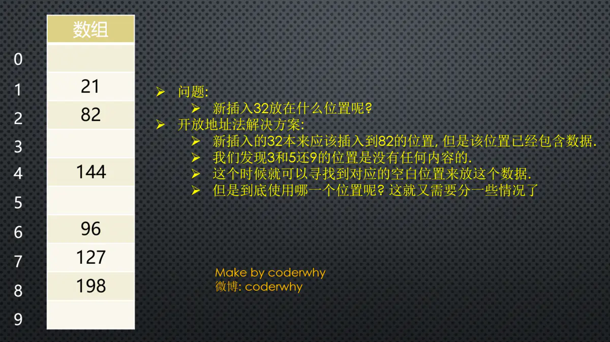

# 认识哈希表

## 数组

- 数组进行`删除插入`操作时，效率比较低
- 数组进行`查找`操作的效率
    - 如果基于`索引`进行查找，那么操作效率非常高
    - 如果基于`内容`查找，那么效率比较低

## 哈希表介绍

> 哈希表通常是`基于数组`进行实现的, 但是相对于数组, 它也很多的优势

- 它可以提供非常快速的`插入-删除-查找操作`
- 无论多少数据, 插入和删除值需要接近常量的时间: 即O(1)的时间级. 实际上, 只需要`几个机器指令`即可
- 哈希表的速度比`树还要快`, 基本可以瞬间查找到想要的元素
- 哈希表相对于树来说编码要容易很多.

> 哈希表相对于数组的一些不足:

- 哈希表中的数据是`没有顺序`的, 所以不能以一种固定的方式(比如从小到大)来遍历其中的元素.
- 通常情况下, 哈希表中的key是`不允许重复`的, 不能放置相同的key, 用于保存不同的元素.

> 哈希表到底是什么呢

`它的结构就是数组`, 但是它神奇的地方在于对`下标值的一种变换`, 这种变换我们可以称之为`哈希函数`, 通过哈希函数可以获取到`HashCode`

## 哈希表的一些概念

- **哈希化**: 将`大数字`转化成`数组范围内下标`的过程, 我们就称之为`哈希化`.
- **哈希函数**: 通常我们会将`单词`转成`大数字`, `大数字`在进行`哈希化`的代码实现放在一个函数中, 这个函数我们成为`哈希函数`.
- **哈希表**: 最终将数据插入到的这个`数组`,对整个`结构的封装`,我们就称之为是一个`哈希表`

## 下标值的变换

> 但是, 怎样才能将一个字符串转成数组的下标值呢?

- `单词/字符串`转`下标值`, 其实就是`字母/文字`转`数字`
- 怎么转?

> 现在我们需要设计一种方案, 可以将`单词`转成`适当的下标`:

- 其实计算机中有`很多的编码方案`就是用数字代替单词的字符,就是`字符编码`
- 比如`ASCII编码`: a是97, b是98, 依次类推122代表z
- 我们也可以设计一个`自己的编码系统`, 比如`a是1`, `b是2`, `c是3`, 依次类推, `z是26`. 
- 当然我们可以加上`空格用0代替`, 就是`27个字符`(不考虑大写问题)
- 但是, 有了编码系统后, 一个单词如何转成数字呢?

## 字母转数字

**但是, 怎样才能将一个转成数组的下标值呢?**

### 方案一: 数字相加

- 一个转换单词的`简单方案`就是把单词每个字符的编码求和.
- 例如单词`cats转成数字`: 3+1+20+19=43, 那么43就作为cats单词的下标存在数组中. 

> 问题: 按照这种方案有一个很明显的问题就是`很多单词`最终的下标可能`都是43`

- 比如was/tin/give/tend/moan/tick等等.
- 我们知道数组中一个下标值位置只能存储一个数据, 如果存入后来的数据, 必然会造成数据的覆盖.
- 一个下标存储这么多单词显然是不合理的.

### 方案二: 幂的连乘

- 现在, 我们想通过一种算法, 让cats转成数字后`不那么普通`.
- `数字相加`的方案就有些`过于普通`了.
- 有一种方案就是使用`幂的连乘`, 什么是幂的连乘呢?
- 其实我们平时使用的`大于10的数字`, 可以用一种`幂的连乘来表示它`的唯一性:比如: 7654 = 7*10³+6*10²+5*10+4
- 我们的单词也可以使用`这种方案`来表示: 比如cats = 3*27³+1*27²+20*27+17= 60337
- 这样得到的数字可以`基本`保证它的`唯一性`, 不会和别的单词重复.

> 问题: 如果一个单词是zzzzzzzzzz(一般英文单词不会超过10个字符). 那么得到的数字超过7000000000000. 数组可以表示这么大的下标值吗?

- 而且就算能创建这么大的数组, 事实上有很多是无效的单词.
- 创建这么大的数组是没有意义的.

## 下标值的压缩

> 现在需要一种`压缩方法`, 把幂的连乘方案系统中得到的`巨大整数范围`压缩到`可接受的数组范围`中.

### 对于英文词典, 多大的数组才合适呢

  - 如果只有50000个单词, 可能会定义一个长度为50000的数组.
  - 但是实际情况中, 往往需要`更大的空间`来存储这些单词. 因为我们不能保存单词会映射到每一个位置. 
  - 比如两倍的大小: 100000

### 如何压缩呢

  - 现在, 就找一种方法, 把0到超过7000000000000的范围, `压缩`为从0到100000.
  - 有一种简单的方法就是使用取余操作符, 它的作用是得到一个数被另外一个数整除后的余数.

### 取余操作的实现

  - 为了看到这个方法如何工作, 我们先来看一个`小点的数字范围`压缩到一个`小点的空间`中.
  - 假设把从0~199的数字, 比如使用`largeNumber`代表, 压缩为从0到9的数字, 比如使用`smallRange`代表.
  - 下标值的结果: index = largeNumber % smallRange;
  - 当一个数被10整除时, 余数一定在0~9之间;
  - 比如13%10=3, 157%10=7.
  - 当然, 这中间还是会有重复, 不过重复的数量明显变小了. 因为我们的数组是100000, 而只有50000个单词.
  - 就好比, 你在0~199中间选取5个数字, 放在这个长度为10的数组中, 也会重复, 但是重复的概率非常小. (后面我们会讲到真的发生重复了应该怎么解决)

## 地址的冲突

尽管50000个单词, 我们使用了100000个位置来存储, 并且通过一种相对比较好的哈希函数来完成.
但是依然`有可能会发生冲突`

- 比如melioration这个单词, 通过哈希函数得到它数组的下标值后, 发现那个位置上已经存在一个单词demystify
- 因为它经过哈希化后和melioration得到的下标实现相同的.

**这种情况我们成为冲突.**

### 什么是冲突

前面前言部分我们已经简单说明了, 什么是冲突. 虽然我们不希望这种情况发生, 当然更希望每个下标对应一个数据项, 但是通常这是不可能的.冲突`不可避免`，我们只能`解决冲突`

> 就像之前0~199的数字选取5个放在长度为10的单元格中

- 如果我们随机选出来的是33, 82, 11, 45, 90, 那么最终它们的位置会是3-2-1-5-0, 没有发生冲突.
- 但是如果其中有一个33, 还有一个73呢? 还是发生了冲突.

> 我们需要针对`这种冲突`提出一些`解决方案`

- 即使冲突的`可能性比较小`, 你依然需要`考虑到这种情况`
- 以便发生的时候进行对应的`处理代码`.

> 如何解决这种冲突呢? 常见的情况有两种方案.

- 链地址法.
- 开放地址法.

### 链地址法

#### 图片解析

- 从图片中我们可以看出, 链地址法解决冲突的办法是`每个数组单元`中存储的不再是`单个数据`, 而是一个`链条`.
- 这个链条使用什么数据结构呢? 常见的`是数组`或者`链表`.
- 比如是`链表`, 也就是每个数组单元中存储着一个链表. 一旦发现重复, 将重复的元素`插入`到链表的`首端或者末端`即可.
- 当查询时, 先根据哈希化后的下标值找到对应的位置, 再取出链表, 依次查询找寻找的数据.

#### 数组还是链表呢

- 数组或者链表在这里其实都可以, `效率上也差不多`.
- 因为根据哈希化的index找出这个数组或者链表时, 通常就会使用`线性查找`, 这个时候数组和链表的效率是差不多的.
- 当然在某些实现中, 会将新插入的数据放在`数组或者链表的最前面`, 因为觉得`新插入的数据`用于`取出的可能性更大`.
- `这种情况最好采用链表`, 因为数组在首位插入数据是需要所有其他项后移的, 链表就没有这样的问题.
- 当然, 我觉得出于这个`也看业务需求`, 不见得新的数据就访问次数会更多: 比如我们微信新添加的好友, 可能是刚认识的, 联系的频率不见得比我们的老朋友更多, 甚至新加的只是聊一两句.
- 所以, 这里个人觉得选择数据或者链表都是可以的.

### 开放地址法

> 开放地址法的主要工作方式是`寻找空白的单元格`来添加重复的数据.

开放地址法其实就是要`寻找空白的位置`来放置冲突的数据项. 

但是探索这个位置的方式不同, 有三种方法:

#### 线性探测

> 线性探测非常好理解: `线性的查找空白的单元` 

- **插入的32**
    - 经过哈希化得到的index=2, 但是在插入的时候, 发现该位置已经有了82. 怎么办呢?
    - 线性探测就是从`index位置+1`开始一点点查找`合适的位置`来放置32, 什么是合适的位置呢?  
    - `空的位置就是合适的位置`, 在我们上面的例子中就是index=3的位置, 这个时候32就会放在该位置.

- **查询32呢?**
    - 查询32和插入32比较相似.
    - 首先经过哈希化得到index=2, 比如2的位置结果和查询的数值是否相同, 相同那么就直接返回.
    - 不相同呢? 线性查找, 从`index位置+1`开始查找和32一样的.
    - 这里有一个特别需要注意的地方: 如果32的位置我们之前`没有插入`, 是否将整个哈希表查询一遍来确定32存不存在吗?
    - 当然不是, 查询过程有一个约定, 就是查询到`空位置, 就停止`. 
    - 因为查询到这里有空位置, 32之前不可能跳过空位置去其他的位置.

- **删除32呢?**
    - 删除操作和插入查询比较类似, 但是也有一个`特别注意点`.
    - 注意: 删除操作一个数据项时, `不可以`将这个位置下标的内容`设置为null`, 为什么呢?
    - 因为将它设置为null可能会`影响我们之后查询其他操作`, 所以通常`删除一个位置的数据项`时, 我们可以`将它进行特殊处理`(比如设置为-1).
    - 当我们之后看到-1位置的数据项时, 就知道查询时要`继续查询`, 但是插入时这个位置可以放置数据.

- **线性探测的问题:**
    - 线性探测有一个比较严重的问题, 就是聚集. 什么是聚集呢?
    - 比如我在没有任何数据的时候, 插入的是22-23-24-25-26, 那么意味着下标值:2-3-4-5-6的位置都有元素.
    - 这种`一连串填充单元`就叫做`聚集`.
    - 聚集会影响哈希表的`性能`, 无论是插入/查询/删除都会影响.
    - 比如我们插入一个32, 会发现`连续的单元`都`不允许`我们放置数据, 并且在这个过程中我们需要探索多次.
    - 二次探测可以解决一部分这个问题, 我们一起来看一看

#### 二次探测

> 我们刚才谈到, 线性探测存在的问题: 就是如果之前的数据时`连续插入`的, 那么新插入的一个数据可能需要`探测很长的距离`.

**二次探测在线性探测的基础上进行了优化:**

- 二次探测主要优化的是`探测时的步长`, 什么意思呢?
- `线性探测`, 我们可以看成是步长为1的探测, 比如从下标值x开始, 那么线性测试就是x+1, x+2, x+3依次探测.
- `二次探测`, 对步长做了优化, 比如从下标值x开始, x+1², x+2², x+3².
- 这样就可以`一次性探测比较长的距离`, 以避免那些聚集带来的影响.

**二次探测的问题:**

- 但是二次探测依然存在问题, 比如我们连续插入的是32-112-82-2-192, 那么它们依次累加的时候步长的相同的.
- 也就是这种情况下会造成`步长不一的一种聚集`. 还是会影响效率.
- 怎么根本解决这个问题呢? 让`每个人的步长不一样`, 一起来看看`再哈希法`吧.

#### 再哈希法

> 为了消除线性探测和二次探测中无论步长+1还是步长+平法中存在的问题, 还有一种最常用的解决方案: 再哈希法.

- **再哈希法:**

    - 二次探测的算法产生的探测序列步长是固定的: 1, 4, 9, 16, 依次类推.
    - 现在需要一种方法: 产生一种`依赖关键字的探测序列`, 而不是每个关键字都一样.
    - 那么, `不同的关键字`即使映射到`相同的数组下标`, 也可以使用`不同的探测序列`.
    - 再哈希法的做法就是: 把关键字用另外一个哈希函数, `再做一次哈希化`, 用这次哈希化的`结果作为步长`.
    - 对于`指定的关键字`, `步长`在整个探测中是`不变`的, 不过`不同的关键字`使用`不同的步长`.

- **第二次哈希化需要具备如下特点:**

    - 和`第一个哈希函数不同`. (不要再使用上一次的哈希函数了, 不然结果还是原来的位置)
    - `不能输出为0`(否则, 将没有步长. 每次探测都是原地踏步, 算法就进入了死循环)

其实, 我们不用费脑细胞来设计了, 计算机专家已经设计出一种工作很好的哈希函数:

- stepSize = constant - (key % constant)
- 其中constant是质数, 且小于数组的容量.
- 例如: stepSize = 5 - (key % 5), 满足需求, 并且结果不可能为0.

## 哈希化的效率

> 哈希表中执行插入和搜索操作可以达到O(1)的时间级

- 如果`没有发生冲突`，只需要使用一次哈希函数和数组的引用，就可以插入一个新数据项或找到一个已经存在的数据项。
- 如果`发生冲突`，存取时间就依赖后来的探测长度。一个单独的查找或插入时间与探测的长度成正比，这里还要加上哈希函数的常量时间。
- 平均探测长度以及平均存取时间，取决于`填装因子`，随着填装因子变大，探测长度也越来越长。
- 随着填装因子变大，效率下降的情况，在不同开放地址法方案中比链地址法更严重, 所以我们来对比一下他们的效率, 再决定我们选取的方案.

### 装填因子

在分析效率之前, 我们先了解一个概念: 装填因子.

- 装填因子表示当前哈希表中已经`包含的数据项`和`整个哈希表长度`的`比值`.
- `装填因子 = 总数据项 / 哈希表长度`.
- `开放地址法的装填因子`最大是多少呢? `1`, 因为它必须寻找到空白的单元才能将元素放入.
- `链地址法的装填因子`呢? `可以大于1`, 因为拉链法可以无限的延伸下去, 只要你愿意. (当然后面效率就变低了)

### 开放地址法

我们来一个个认识一下开放地址法中每种方案的效率.

#### 线性探测

> 下面的等式显示了线性探测时，探测序列(P)和填装因子(L)的关系

- 对成功的查找: P = (1+1/(1-L))/2
- 对不成功的查找: P=(1+1/(1-L)^2)/2
- 公式来自于Knuth(算法分析领域的专家, 现代计算机的先驱人物), 这些公式的推导自己去看了一下, 确实有些繁琐, 这里不再给出推导过程, 仅仅说明它的效率.

- 当填装因子是1/2时，成功的搜索需要1.5次比较，不成功的搜索需要2.5次
- 当填装因子为2/3时，分别需要2.0次和5.0次比较
- 如果填装因子更大，比较次数会非常大。
- 应该使填装因子保持在2/3以下，最好在1/2以下，另一方面，填装因子越低，对于给定数量的数据项，就需要越多的空间。
- 实际情况中，最好的填装因子取决于存储效率和速度之间的平衡，随着填装因子变小，存储效率下降，而速度上升。

#### 二次探测和再哈希

二次探测和再哈希法的性能相当。它们的性能比线性探测略好。

- 对成功的搜索，公式是: -log2(1 - loadFactor) / loadFactor
- 对于不成功的搜搜, 公式是: 1 / (1-loadFactor)

- 当填装因子是0.5时，成功和不成的查找平均需要2次比较
- 当填装因子为2/3时，分别需要2.37和3.0次比较
- 当填装因子为0.8时，分别需要2.9和5.0次
- 因此对于较高的填装因子，对比线性探测，二次探测和再哈希法还是可以忍受的。

### 链地址法

链地址法的效率分析有些不同, 一般来说比开放地址法简单. 我们来分析一下这个公式应该是怎么样的.

- 假如哈希表包含arraySize个数据项, 每个数据项有一个链表, 在表中一共包含N个数据项.
- 那么, 平均起来每个链表有多少个数据项呢? 非常简单, N / arraySize.
- 有没有发现这个公式有点眼熟? 其实就是装填因子.

OK, 那么我们现在就可以求出查找成功和不成功的次数了

- 成功可能只需要查找链表的一半即可: 1 + loadFactor/2
- 不成功呢? 可能需要将整个链表查询完才知道不成功: 1 + loadFactor.

#### 效率的结论

经过上面的比较我们可以发现, 链地址法相对来说效率是好于开放地址法的.
所以在真实开发中, 使用链地址法的情况较多

- 因为它不会因为添加了某元素后性能急剧下降.
- 比如在Java的HashMap中使用的就是链地址法.

